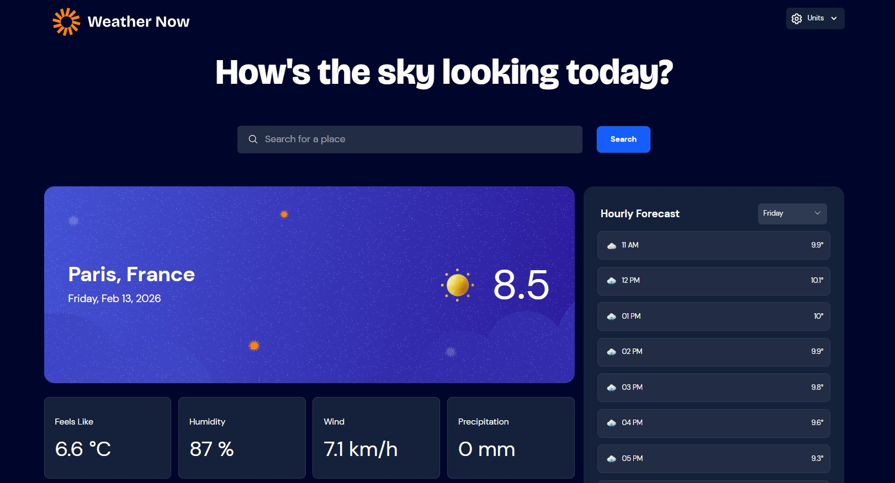

# Frontend Mentor - Weather app solution

This is a solution to the [Weather app challenge on Frontend Mentor](https://www.frontendmentor.io/challenges/weather-app-K1FhddVm49).

## Table of contents

- [Frontend Mentor - Weather app solution](#frontend-mentor---weather-app-solution)
  - [Table of contents](#table-of-contents)
  - [Overview](#overview)
    - [The challenge](#the-challenge)
    - [Screenshot](#screenshot)
    - [Links](#links)
  - [My process](#my-process)
    - [Built with](#built-with)
    - [What I learned](#what-i-learned)
    - [Continued development](#continued-development)
  - [Author](#author)

## Overview

### The challenge

Users should be able to:

- Search for weather information by entering a location in the search bar
- View current weather conditions including temperature, weather icon, and location details
- See additional weather metrics like "feels like" temperature, humidity percentage, wind speed, and precipitation amounts
- Browse a 7-day weather forecast with daily high/low temperatures and weather icons
- View an hourly forecast showing temperature changes throughout the day
- Switch between different days of the week using the day selector in the hourly forecast section
- Toggle between Imperial and Metric measurement units via the units dropdown
- Switch between specific temperature units (Celsius and Fahrenheit) and measurement units for wind speed (km/h and mph) and precipitation (millimeters) via the units dropdown
- View the optimal layout for the interface depending on their device's screen size
- See hover and focus states for all interactive elements on the page

### Screenshot

### Links

- Solution URL: https://github.com/cameaann/weather-web-app
- Live Site URL: https://cameaann.github.io/weather-web-app/

## My process

### Built with

- Semantic HTML5 markup
- CSS custom properties
- Flexbox
- CSS Grid
- Mobile-first workflow
- [React](https://reactjs.org/) - JS library
- [Vite.js](https://vite.dev/) - Frontend framework
- [Tailwind](https://tailwindcss.com/) - For styles
- [daisyui](https://daisyui.com/?lang=en) - Tailwind component library
- [dayjs](https://day.js.org/) - JavaScript library that parses, validates, manipulates, and displays dates and times for modern browsers
- [React Geocoder Autocomplete](https://geoapify.github.io/react-geocoder-autocomplete/) - Geocoder Autocomplete library
- [Open-Meteo](https://open-meteo.com/) -  Free open-source weather API

### What I learned

In this project I wanted to learn the Tailwind library.

### Continued development

Next time I plan to build a Java Spring Boot backend and turn this into a full-stack application.

## Author

- Website - [Anna](https://cameaann.github.io/)
- Frontend Mentor - [@cameaann](https://www.frontendmentor.io/profile/cameaann)
